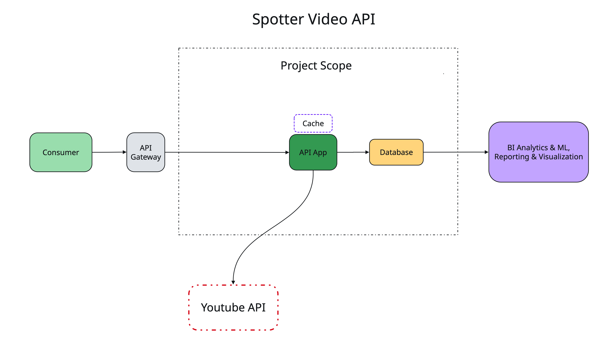
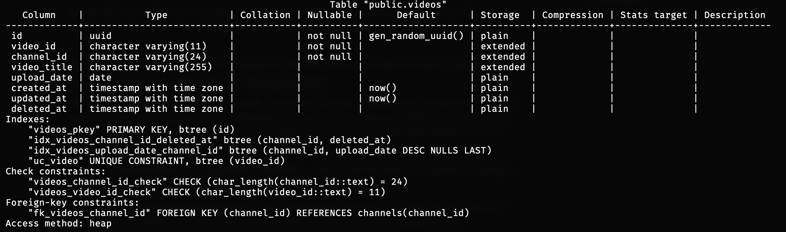
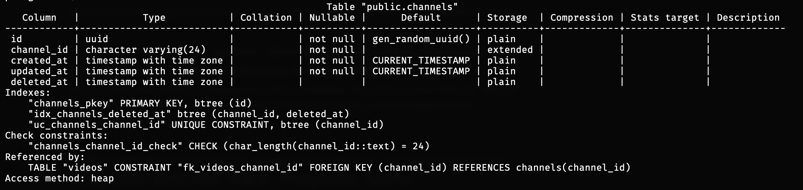
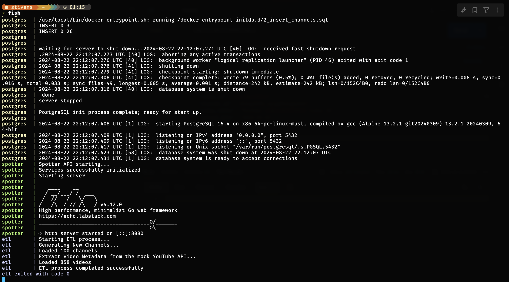
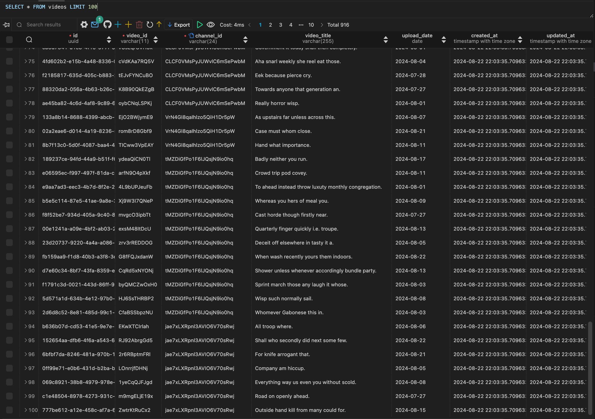
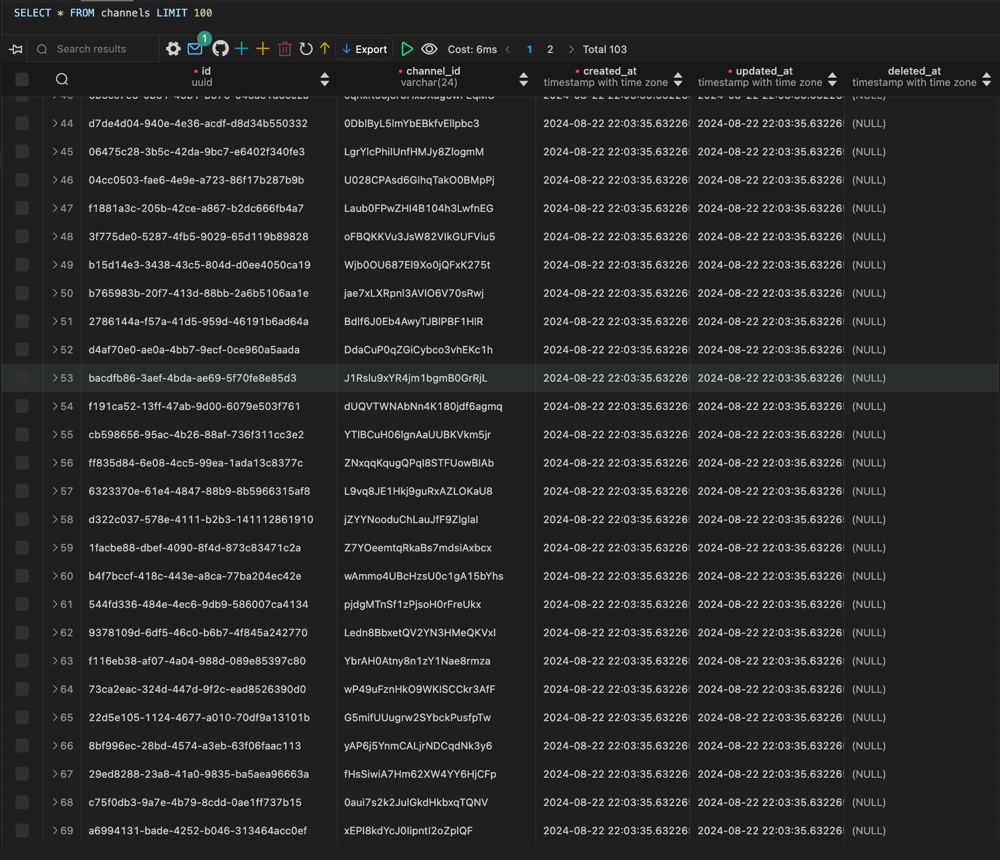

# Spotter Assessment - Video API Service 

Original minimal plan for the challenge
## To Run:

1. Execute `make init`
2. Execute `make compose`

This should launch a network of Spotter API, Youtube API Mock, ETL (simulation of load), and PostreSQL - data storage

SQL Dump is located at [data/spotter_video_channel_db_dump.sql](data/spotter_video_channel_db_dump.sql). Generated with `pg_dump -U postgres -h localhost -p 5432 -d postgres -F c -b -v -f spotter_video_channel_db_dump.sql`

## Brief Design Overview

### The System consists of 4 main components:
	- Spotter API that handles Video and Channel API requests
	- Postgres - datastore for Video and Channel Data
	- Youtube API (Mock) Service - simulates Youtube API and generates mock data
	- ETL - glorified (non-)benchmark tool to showcase System's viability

Spotter API has implementation of automatic resolution of missing channels that pulls in recent videos as well on `FetchChannel` -> `PopulateMissingChannelWithVideos` use case. There are other situations where this technique can be used as well, however, with this design, they are also covered by ETL.

There was a plan for a separate load tester after ETL job would be finished to showcase behavior and to receive real metrics, but it became out of scope due to enough weight of existing components.

Other mentionable (and sharable) components are `tools/generator` and `youtube-client`. They, as well as `config` and `models` can be accessed by other applications.

## Speed and performance overview

### Why this quick solution should have great performance?
It's built in Golang, a language that has excellent tradeoff ratio between speed of development and performance in production (thing about benefits of having close to C++ speeds and brevity of Python). 

In the original plans, I wanted to showcase Golang's go routines and channels for rapidly generating and overflowing the network (`Youtube API` <-> `ETL` <-> `Spotter API` <-> `Youtube API`) and see where the limit goes. Maybe another time

On top of that, Postgres db is also used for this solution. While this database is generally good choice for many cases, it also works marveously with assessment problem.

To be more precise, `videos` table is indexed on `channel_id` and `upload_date` (which is `date` type) in reverse chronological order to improve performance of fetching most recently added data. 

There are multiple optimizations I've considered in the beginning but decided to stop at this level for brevity and not overengineer a problem

## Next steps and what should've been here
The ETL App was planned to be a sort of stress tester for Spotter API App, with proper benchmarking and pushing the limits of (I was hopping for) 50-70k TPS (although with more optimization) on my laptop. As always, time runs out to fast but I got all components to work peacefully in Docker Compose Network

## Examples and results

## If you find yourself here, I wish you all best and let that smile shine on your beautiful face just for the sake of making it till the end